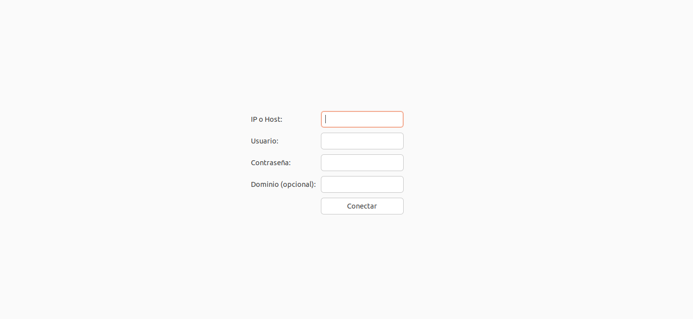

# ThinClient RDP Kiosk

Convierte ordenadores antiguos en **Thin Clients** con Ubuntu 24.04 que arrancan en modo kiosko y permiten conectarse vía **RDP** con un formulario gráfico mínimo.

## Características
- Interfaz GTK con campos: IP/Host, Usuario, Contraseña y Dominio.
- Conexión a Remmina en pantalla completa (archivo .remmina temporal).
- Modo kiosko: autologin, ocultar dock, bloqueo de input para mantener la sesión limitada.
- Limpieza y eliminación segura del archivo de conexión tras cerrar Remmina.

## Estructura del repositorio
```
thinclient-rdp-kiosk/
├─ src/                   # Código fuente principal (rdp-login.py)
├─ docs/                  # Documentación y recursos (instalacion.md)
│   └─ images/            # Capturas, diagramas, etc.
├─ .gitignore
├─ README.md
├─ requirements.txt
└─ LICENSE
```

## Requisitos rápidos
Sistema: **Ubuntu Desktop 24.04** (sesión Xorg recomendada)<br>
Dependencias (instalar con apt):
```bash
sudo apt update
sudo apt install -y python3 python3-gi remmina remmina-plugin-rdp yad feh openbox
```

## Instalación resumida
1. Clonar el repositorio:
```bash
git clone https://github.com/Teodosiodg2002/thinclient-rdp-kiosk.git
cd thinclient-rdp-kiosk
```
2. Copiar `src/rdp-login.py` a `/home/kiosko/bin/` y ajustar permisos (ver `docs/instalacion.md` para instrucciones completas).

## Fotos


---

Autor: Teodosio Donaire González — Licencia: MIT
